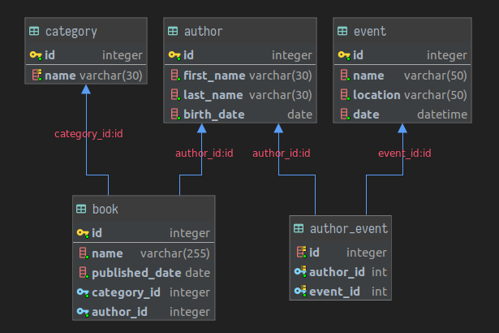

# SQL



## 1. Query

Based on the SQL diagram above, write the following queries:

**A.** Get authors with a last name beginning with "M" or who are born after 1950.

**Answer:**
```mysql
#
SELECT a.first_name,a.last_name
FROM author as a
WHERE last_name like 'M%' OR YEAR(birth_date) > 1950
```

**B.** Count the number of books per category (empty categories too).

**Answer:**
```mysql
#
SELECT c.name, COUNT(b.id)
FROM category as c
LEFT JOIN book as b ON c.id = b.category_id
GROUP BY c.name
```

**C.** Find authors who wrote at least 2 books.

**Answer:**
```mysql
# 
SELECT a.first_name,a.last_name,COUNT(b.id)
FROM author as a
JOIN book as b ON a.id = b.author_id
GROUP BY a.id
HAVING COUNT(b.id) > 1
```

**D.** Get 50 authors with at least one event between the start and the end of this year.

**Answer:**
```mysql
#
SELECT a.first_name,a.last_name
FROM author as a
Join author_event as ae ON a.id = ae.author_id
Join event as e ON ae.event_id = e.id
WHERE YEAR(e.date) = YEAR(CURDATE())
GROUP BY (a.id)
LIMIT 50

```

**E.** Get the average number of books written by authors.

**Answer:**
```mysql
#
SELECT AVG(new_table.book_nbr)
FROM(
    SELECT a.id AS author_id, count(a.id) AS book_nbr
    FROM author as a
    JOIN book as b ON a.id = b.author_id
    GROUP BY a.id
) as new_table
```

**F.** Get authors, sorted by the date of their **latest** event.

**Answer:**
```mysql
#
SELECT a.last_name
FROM author as a
Join author_event as ae ON a.id = ae.author_id
Join event as e ON ae.event_id = e.id
Group by (a.last_name)
ORDER BY MAX(e.date) DESC
```

## 2. Database Structure

**A.** Based on the SQL diagram above, what can be done to improve the performance of this query ?

```mysql
SELECT id, name FROM book WHERE YEAR(published_date) >= '1973';
```

**Answer:** Je ne sais pas.


**B.** Give 3 common good practice on a database structure to optimize queries.

**Answer:** 
 - Préciser les champs du SELECT strictement nécessaire au lieu d'un SELECT *
 - Créer des jointures avec JOIN plutôt que WHERE
 - Préférer utiliser un WHERE avant un GROUP BY plutôt qu'un HAVING après.
